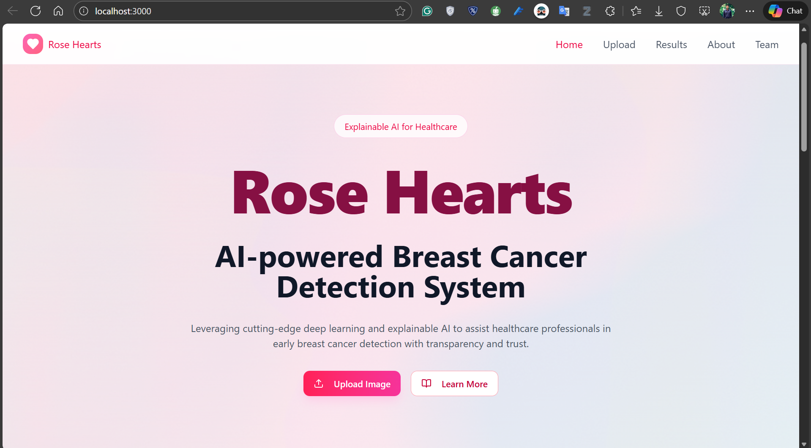
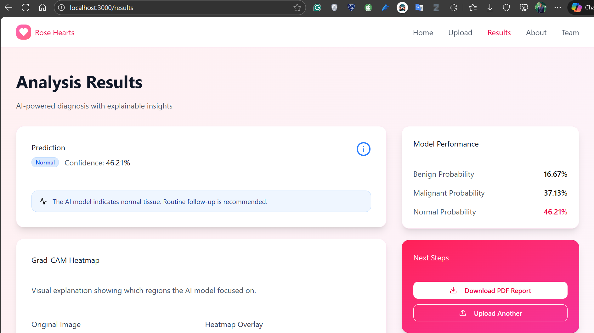
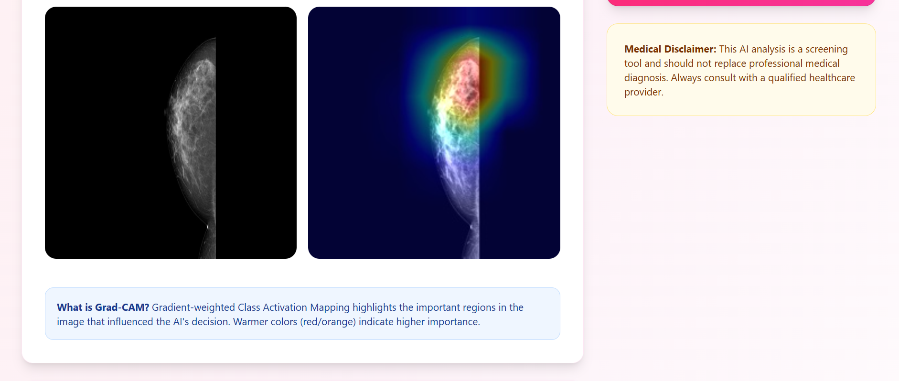
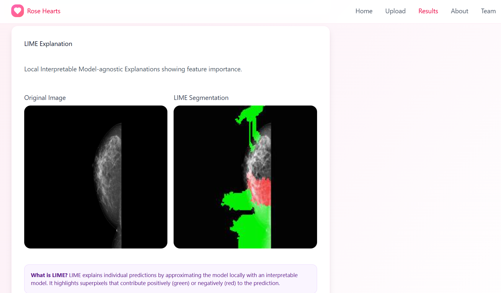

# Rose Hearts: AI-Powered Breast Cancer Detection System

**Rose Hearts** is a web-based decision support system designed to assist radiologists in the early detection of breast cancer from mammograms. It utilizes advanced Deep Learning (ResNet-50) and Explainable AI (XAI) to provide accurate, transparent, and trustworthy diagnostic insights.

<div align="center">
  
</div>
<div align="center">
  
</div>
<div align="center">
  
</div>
<div align="center">
  
</div>

-----

## 🧐 Background & Problem

Breast cancer is the leading cause of cancer-related mortality among Sri Lankan women. Early detection is critical, but standard screening faces significant challenges:

  * **High False Positives:** Leading to unnecessary biopsies and patient anxiety.
  * **Missed Diagnoses (False Negatives):** Particularly in dense breast tissue, where tumors are hard to see.
  * **"Black Box" AI:** Lack of transparency in AI predictions prevents clinical trust.

**Rose Hearts** addresses these by offering a low-cost, accessible web tool that classifies standard 2D mammograms and visually explains *why* a prediction was made.

-----

## ✨ Key Features

  * **Automated Classification:** Classifies mammograms into **Normal**, **Benign**, or **Malignant** with high accuracy.
  * **Explainable AI (XAI):**
      * **Grad-CAM:** Heatmaps showing the general region of interest.
      * **LIME:** Granular segmentation highlighting specific super-pixels.
  * **Robust Preprocessing:** Uses **CLAHE** (Contrast Limited Adaptive Histogram Equalization) to enhance features in dense breast tissue.
  * **Instant Reporting:** Generates downloadable PDF reports with diagnosis, confidence scores, and visual evidence.
  * **Privacy Focused:** Processes images locally/securely without permanent storage.

-----

## 🏗️ System Architecture

### **Tech Stack**

  * **Frontend:** React (Vite), TypeScript, Tailwind CSS, Shadcn/UI.
  * **Backend:** Python, FastAPI, Uvicorn.
  * **AI Engine:** TensorFlow/Keras, OpenCV, NumPy.
  * **Model:** Fine-tuned **ResNet-50** CNN (Pre-trained on ImageNet).

### **Data Pipeline**

The model was trained on a **Composite Dataset** of **26,602 images** combining three global standards:

1.  **MIAS** (Mammographic Image Analysis Society) 
2.  **InBreast** (Full Field Digital Mammograms) 
3.  **DDSM** (Digital Database for Screening Mammography) 

-----

## 📊 Performance

The system was rigorously evaluated on an independent test set.

| Metric | Score | Description |
| :--- | :--- | :--- |
| **Accuracy** | **91.83%** | Overall correctness of predictions. |
| **Recall (Sensitivity)** | **91.75%** | Ability to correctly identify Malignant cases (Critical for minimizing false negatives). |
| **Precision** | **91.84%** | Ability to minimize False Positives. |
| **AUC Score** | **0.9864** | Excellent discriminative ability between classes. |

> **Note:** The model outperformed other architectures like InceptionV3 and EfficientNetB0 in our experiments.

-----

## ⚙️ Installation & Setup

### Prerequisites

  * **Git LFS** (Large File Storage) - *Required for downloading the model weights.*
  * **Python 3.10+**
  * **Node.js 18+**

### 1\. Clone the Repository

```bash
# Install Git LFS first if you haven't
git lfs install

# Clone the repo
git clone https://github.com/Induwara24/Rose-Hearts.git
cd Rose-Hearts
```

### 2\. Backend Setup

```bash
cd backend

# Create a virtual environment
python -m venv venv

# Activate it (Windows)
.\venv\Scripts\activate
# Activate it (Mac/Linux)
# source venv/bin/activate

# Install dependencies
pip install -r requirements.txt
```

### 3\. Frontend Setup

```bash
cd ../frontend

# Install Node modules
npm install
```

-----

## 🚀 Usage

### Step 1: Start the Backend Server

Open a terminal in the `backend` folder:

```bash
# Ensure venv is active
uvicorn server:app --reload --host 0.0.0.0 --port 8000
```

*Wait until you see the message:* `✅ Model weights loaded and verified successfully!`

### Step 2: Start the Frontend

Open a new terminal in the `frontend` folder:

```bash
npm run dev
```

Open your browser to `http://localhost:5173`.

### Step 3: Diagnosis

1.  Navigate to the **Upload** page.
2.  Drag and drop a mammogram image (JPG/PNG).
3.  Click **Submit for Analysis**.
4.  View the prediction, confidence score, and XAI heatmaps on the **Results** dashboard.
5.  Download the **Analysis Report**.

-----

## ⚠️ Known Limitations

  * **Domain Shift (Photographs vs. Scans):** The model is optimized for **direct digital mammograms** (scanned images). During validation at Sri Lanka Cancer Hospital, performance degraded on *photographs* of physical films due to glare, uneven lighting, and camera noise.
  * **Preprocessing Sensitivity:** The system applies CLAHE automatically. Uploading images that have *already* been enhanced may lead to "Double CLAHE" artifacts, affecting accuracy. Please upload **RAW** images for best results.

-----

## 🗺️ Roadmap

  * [ ] **Clinical Trials:** Formal validation with a second ethical clearance for live patient testing.
  * [ ] **3D Mammography (DBT):** Upgrading the model to process Digital Breast Tomosynthesis volumes.
  * [ ] **PACS Integration:** Direct integration with hospital DICOM servers for seamless data retrieval.

-----

## 👥 Authors & Acknowledgments

**Research Team:**

  * **Induwara Sithum Siriwardana**
  * **Januthma Sadamini Dharmadasa**
  * **Thivanka Chathuranga Ekanayaka**

**Supervisors:**

  * **Ms. Asanka Ranasinghe** (Principal Supervisor)
  * **Ms. Rusini Siyara Liyanachchi** (Co-Supervisor)
  * **Dr. Akalanka Muthukumarana** (Medical Supervisor - Surgical SHO, BH Balapitiya) 

*Special thanks to the staff of the National Cancer Institute (Maharagama) and Sri Lanka Cancer Hospital (Karapitiya) for their support.* 

-----

## 📄 License

This project is licensed under the **MIT License**.
